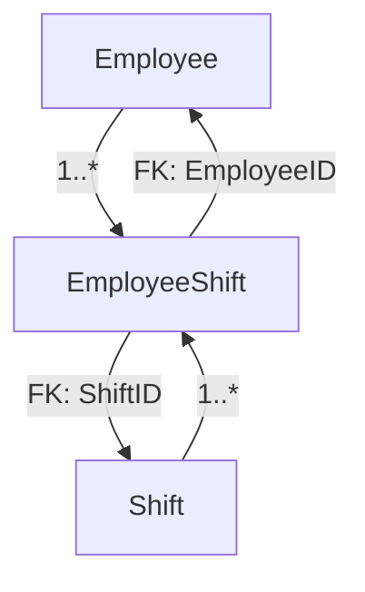
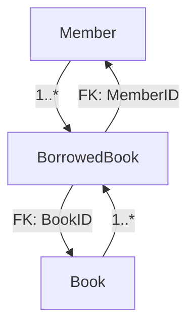

# Integrated Staff and Library Management System

A collaborative project developed by:
- **Omole Emmanuel Oreoluwa** - Staff Management Module
- **Emmanuel Inobode** - Library Management Module

## About The Project

This project is an integrated system that combines staff management and library management functionalities. It was built as a learning exercise to understand the core concepts of building a modern, data-driven web application from the ground up. The project demonstrates the integration of two distinct but complementary systems into a single, cohesive application.

## Features

### Staff Management Module (by Omole Emmanuel)
* **Employee Management:** Full CRUD (Create, Read, Update, Delete) functionality for employees.
* **Shift Management:** Full CRUD functionality for shifts.
* **Shift Assignment:** Assign employees to shifts and view assignments.

### Library Management Module (by Emmanuel Inobode)
* **Book Management:** Full CRUD functionality for books with detailed tracking.
* **Member Management:** Full CRUD functionality for library members.
* **Borrowing System:** Comprehensive book borrowing and return functionality.
* **History Tracking:** Detailed history of book borrowings and returns.
* **Status Monitoring:** Track book availability and due dates.

### Shared Features
* **Custom UI:** A modern, responsive user interface with a sidebar navigation and card-based layouts.
* **RESTful API:** Comprehensive API endpoints for both modules.
* **Detailed Reporting:** Statistics and history views for both systems.

## Technologies Used

This project is built on the .NET platform and utilizes several key technologies:

* **Backend:**
  * **ASP.NET Core MVC:** For building the web application following the Model-View-Controller pattern.
  * **Entity Framework Core:** As the Object-Relational Mapper (ORM) to interact with the database.
  * **RESTful APIs:** API controllers to expose application data.
* **Database:**
  * **SQLite:** A lightweight, file-based database, managed via Entity Framework Core migrations.
* **Frontend:**
  * **Razor Views:** For creating dynamic web pages.
  * **Bootstrap:** For the core layout and component styling.
  * **Custom CSS:** For creating a unique visual identity for the application.
* **Architecture & Patterns:**
  * **MVC (Model-View-Controller):** To separate concerns within the application.
  * **Service Pattern (using Interfaces):** To abstract the business logic from the controllers.
  * **Dependency Injection:** Using the built-in .NET container to manage service lifetimes.

## Data Models & Relationships

The application consists of two main modules with their respective data models.

### Staff Management Models



#### 1. EmployeeModel
- `EmployeeID` (Primary Key): Unique identifier for the employee.
- `FirstName`: Employee's first name.
- `LastName`: Employee's last name.
- `Email`: Employee's email address.
- `Role`: The job role of the employee.
- `HourlyRate`: The pay rate for the employee.
- `DateHired`: The date the employee was hired.

#### 2. ShiftModel
- `ShiftID` (Primary Key): Unique identifier for the shift.
- `StartDateTime`: The date and time the shift begins.
- `EndDateTime`: The date and time the shift ends.

#### 3. EmployeeShiftModel (Join Table)
- `EmployeeShiftID` (Primary Key): Unique identifier for the assignment entry.
- `EmployeeID` (Foreign Key): Links to the `EmployeeID` in the `EmployeeModel`.
- `ShiftID` (Foreign Key): Links to the `ShiftID` in the `ShiftModel`.

### Library Management Models



#### 1. BookModel
- `BookId` (Primary Key): Unique identifier for the book.
- `Title`: Book's title.
- `Author`: Book's author.
- `ISBN`: International Standard Book Number.
- `Status`: Current status of the book.

#### 2. MemberModel
- `MemberId` (Primary Key): Unique identifier for the member.
- `FirstName`: Member's first name.
- `LastName`: Member's last name.
- `Email`: Member's email address.
- `PhoneNumber`: Member's contact number.

#### 3. BorrowedBookModel
- `BorrowId` (Primary Key): Unique identifier for the borrowing record.
- `MemberId` (Foreign Key): Links to the `MemberId` in the `MemberModel`.
- `BookId` (Foreign Key): Links to the `BookId` in the `BookModel`.
- `BorrowDate`: Date when the book was borrowed.
- `DueDate`: Date when the book should be returned.
- `ReturnDate`: Actual return date (nullable).

## Getting Started

To get a local copy up and running, follow these simple steps.

### Prerequisites

* .NET SDK (This project uses .NET 8)

### Installation & Setup

1. **Clone the repository:**
   ```sh
   git clone https://github.com/Omoleen/StaffManager
   ```
2. **Navigate to the project directory:**
   ```sh
   cd StaffManager
   ```
3. **Restore dependencies:**
   ```sh
   dotnet restore
   ```
4. **Apply database migrations:**
   ```sh
   dotnet ef database update
   ```
5. **Run the application:**
   ```sh
   dotnet run
   ```
   The application will be available at `https://localhost:5001` or a similar address, which will be specified in the terminal output.
